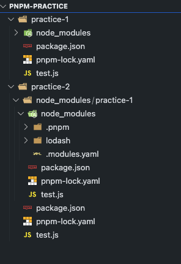

# 개발 환경 세팅

무지성 복붙 그만.

## :whale2: 키워드

* Node.js
* NPM
* package.json
* package-lock.json  
* node_modules
* npx

* CommonJS vs ES Modules

## Node.js

### Node.js란?

Node.js는 자바스크립트 실행 환경이다.
브라우저에서만 동작하던 자바스크립트 엔진을 브라우저 외의 환경에서 독립시켰다.

### Node.js가 왜 필요한가?

타입스크립트를 실행하려면 자바스크립트 런타임 환경이 필요하다. 이 환경이 Node.js이다.

### NPM [Node Package Manager]이란?

자바스크립트 패키지 매니저이다. Node.js에서 사용할 수 있는 모듈을 패키지화 해서 모아둔다.

1. 저장소 역할
2. 패키지 설치 및 관리를 위한 CLI 제공

package.json 으로 정보를 관리한다.

### package.json

이 파일은 다음을 명시한다.

1. 프로젝트 설정
2. 패키지 의존성 정보

### package-lock.json

이 파일은 다음을 명시한다.

1. 패키지 버전 정보
2. 의존성 트리 고정

의존성 트리란, 패키지의 의존 관계를 나타낸 것이다. 의존 관계의 예를 들면, A패키지를 설치할 때 A가 의존하는 패키지가 B와 C라면, B와 C도 설치된다.

### package.json vs package-lock.json

다른 개발자나 다른 환경에서 package.json으로 패키지를 설치하면 동일한 버전의 패키지가 설치되지 않을 수 있다. npm이 패키지를 설치할 때 최신 버전으로 설치하기 때문이다.

그래서 동일 버전의 패키지를 원한다면 package-lock.json으로 설치한다.

### node_modules란?

node_modules에는 npm으로 설치한 패키지의 의존성 트리에 따라 필요한 패키지들이 저장된다.

### node_modules를 .gitignore에 추가하는 이유는?

다른 개발자나 다른 환경에서는 package.json이나 package-lock.json으로 `npm install`을 하면 node_modules를 설치할 수 있기 때문이다.

### npx란?

npm에서 제공하는 도구이다.

npx를 사용하면 전역 설치 없이 패키지를 실행할 수 있다. 로컬에 설치된 패키지를 실행하고, 실행 중에 필요한 의존성 패키지를 자동으로 설치한다.

```shell
# 전역으로 설치하기
npm install -g create-react-app
create-react-app my-app

# npx를 사용하면 전역으로 설치하지 않아도 된다.
npm install create-react-app
npx create-react-app my-app
```

### npm으로 설치하지 않은 패키지를 npx로 실행할 수 있는 이유는?

다음과 같이 npm으로 패키지를 설치하지 않고 npx로 실행하면 npm 패키지들을 캐시하는 곳에서 다운받아 설치하고 실행한다.

macS는 그 장소가 ~/.npm/_npx이다.

```shell
# npm install create-react-app
npx create-react-app my-app
```

### npm run lint와 npx run lint의 차이점이 뭔가?

npx는 설치되지 않은 패키지도 가져온다는 것은 기능의 일부이다. 기본적으로 로컬에 추가된 패키지를 먼저 본다.

run script에 설정하지 않고 바로 실행할 수 있다. 로컬에 없으면 npm의 레지스트리에서 가져와서 설치하고 실행한 뒤 fallback된다. 일회성이다.

추가로, npm 레지스트리는 npm 패키지 매니저에서 패키지를 다운로드하고 업로드할 수 있는 장소이다. `npmjs.com`과 사용자 지정 레지스트리를 만들어 사용할 수 있다.

사용자 지정 레지스트리는 회사 내부에서 사용하는 패키지들을 저장하거나 사설 패키지를 다운로드하여 사용할 수 있다.

## CommonJS vs ES Modules

둘 다 자바스크립트에서 모듈 시스템을 구현하는 방법이다.

`ES Modules`: ECMAScript 6에서 정의된 표준 모듈 시스템이다.

`CommonJs`:기본적으로 사용되는 모듈 시스템이다.

`ES Modules`: import, export로 모듈을 가져오고 내보낸다. 비동기적으로 동작한다.

`CommonJs`: require, module.exports 객체를 사용하여 모듈을 가져오고 내보낸다. 동기적으로 동작한다.

CommonJs가 ES Modules보다 비교적 느리지만 여전히 호환성을 위해 CommonJs를 지원한다.

## npm, yarn, pnpm

승완님의 추천으로 정리하게 됐다.

npm, yarn, pnpm 모두 자바스크립트 패키지 관리 도구이다.

* npm

Node.js의 공식 패키지 관리 도구이다. 라이브러리, 프레임워크, 플러그인, 빌드 도구 등 다양한 패키지를 제공한다.

* yarn

페이스북에서 개발한 패키지 관리 도구이다. npm과 비슷한 기능을 제공하지만, 더 빠르고 안정적인 패키지 설치를 제공한다.

yarn은 패키지 설치를 병렬로 처리하여 더 빠른 것이다.

* pnpm

pnpm은 npm, yarn과 달리 패키지를 독립적으로 설치하는 대신 하나의 패키지 저장소에 패키지를 설치하고 공유할 수 있다. (node_moudles/.pnpm)

## pnpm으로 패키지 설치 및 공유하기

실험을 해봤다. practice-1 폴더 내에 있는 node_modules만 공유할 줄 알았더니 practice-1을 통째로 practice-2와 공유했다.

여러 블로그를 본 결과 이렇게 하는 게 아닌가보다. 따라하려고 해도 따라할 수 없어서 질질 끌다가 포기했다. 다음은 망한 구조이다.



## pnpm의 장점

예를 들어, 100개의 리액트 프로젝트가 있다. 각 프로젝트 별로 npm install을 통해 100개의 node_modules 폴더가 만들어져 용량을 많이 잡아 먹게 된다.
그러나 pnpm을 사용하는 경우 패키지는 각 특정 프로젝트 주소의 .pnpm-store라는 공유 저장소에 저장되며 이를 필요로 하는 프로젝트에서만 링크하면 된다.

## 메모

개발 환경 세팅할 때 나오는 개념을 정리해보는 시간을 가져서 좋았다.

CommonJS vs ES Modules는 추가 작성이 필요해 보인다.
