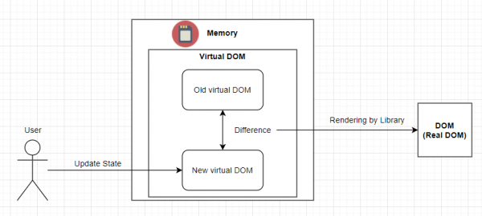

# JSX

## :whale2: 키워드

* Syntactic sugar
* XML
* JSX
* Babel
* React
* VDOM
* 재조정
* React.createElement
* React Element
* React StrictMode
* Reconciliation, 재조정

## Syntactic Sugar란?

코드를 더 쉽게 읽고 쓸 수 있지만, 코드 작동 방식을 근본적으로 변경하지 않은 구문 또는 기능이다. 

예를 들어 화살표 함수.

## XML이란?

데이터를 전송하는데 사용되는 마크업 언어이다.

태그를 사용하여 데이터 구조를 설명하기 때문에 HTML과 유사하다.

```xml
<name>홍길동</name>
```

## JSX란?

자바스크립트 확장 문법이다.

자바스크립트 파일 안에서 HTML과 유사한 마크업을 작성할 수 있다.

## JSX를 왜 써야 할까?

렌더링 로직과 콘텐츠를 같은 위치에 유지할 수 있다.

기존의 방식은 HTML과 자바스크립트 코드가 분리되어 있어서, 어떤 HTML 태그와 자바스크립트 함수가 서로 관련돠어 있는지 파악하기 어려웠다.

React에서는 이러한 관계를 명확하게 파악할 수 있게 됐다.

## 리액트에서 JSX를 사용하는 이유는?

UI 구조의 작성과 추론이 쉽다.

## JSX는 꼭 리액트에서 써야 하는가?

JSX가 리액트의 부산물이고 리액트가 잘 나가서 한 몸처럼 보이지만, JSX와 리액트는 별개의 개념이다. 다른 라이브러리나 프레임워크에서도 사용 가능하다.

```jsx
/* @jsx 감자.createElement */

<Button type="submit">Send</Button>;
```

jsx는 자바스크립트에서 실행이 불가능하다. 자바스크립트로 변환해야 한다.

```javascript
/* @jsx 감자.createElement */

감자.createElement("p", null, "Hello, World");
```

## JSX 없이 사용하는 리액트

JSX 필수 아니야~

React.createElement는 새로운 리액트 엘리먼트를 만든다.

JSX는 HTML처럼 작성된 부분을 React.createElement를 쓰는 자바스크립트 코드로 변환한다. 자바스크립트 코드와 1대1로 매칭된다는 말이다.

따라서 JSX 없이 자바스크립트만으로 작성이 가능하다.

## JSX과 Babel

JSX는 바벨과 같은 도구를 이용해 자바스크립트로 변환항 수 있다.

1주차에서는 JSX를 TS로 변환했다. parcel, jest도 확장 swc로 변환했다.

이번 주차는 바벨을 이용해 자바스크립트로 변환했다.

```jsx
<p>Hello, World</p>

// jsx to js

React.createElement("p", null, "Hello, World");
```

## JSX 규칙

### 단일 루트 엘리먼트 반환

JSX는 다음 같이는 작성할 수 없다!

```jsx
  <p>Hello, world!</p>
  <Button type="submit">Send</Button>

  // jsx to js

  React.createELement(
    React.Fragment,
    null,
  )
```

이유는 리액트 엘리먼트는 React.createElement를 실행하기 위해 1개의 부모만 가질 수 있기 때문이다.

`<div>` 같은 태그로 감싸주고 싶지 않거나 DOM에 태그를 삽입하고 싶지 않다면 Fragement `<React.Fragement></React.Fragement>`를 이용한다. (React.Fragement는 생략 가능)

```jsx
<>
  <p>Hello, world!</p>
  <Button type="submit">Send</Button>
</>

// jsx to js

React.createElement(React.Fragment, null, 
React.createElement("p", null, "Hello, world!"),
React.createElement(Button, {
  type: "submit"
}, "Send"));
```

### 모든 태그 닫기

태그가 비어있다면 XML처럼 />를 이용해 바로 닫아야 한다.

```jsx
<br></br> 

or

<br />
```

### 카멜케이스

속성은 자바스크립트 객체의 키가 된다. 이는 카멜케이스로 작성한다.

예를 들어, class는 HTML 속성 이름이다.(예약어이다.) 그래서 카멜케이스로 className이라고 작성한다.

```jsx

```

### 태그 안에 공백

JSX는 태그 안에서 text와 자바스크립트 값으로만 구분을 한다.

"Count: "처럼 "Count:" 뒤에 공백을 사용하려면 다음과 같이 작성한다. 많이 쓴다고 하는데 아직은 잘 모르겠음.

추가로, JSX는 중괄호를 써서 자바스크립트 코드를 그대로 쓸 수 있다.

```jsx
<div>
  <p>Count: {} {count}!</p> 

  or
  
  <p>{"Count: "}{count * 2}{"!"}</p>

  <button type="button" onClick={() => setCount(count + 1)}>
    Increase
  </button>
</div>;

// jsx to js

React.createElement(
  'div',
  null,
  React.createElement("p", null, "Count: ", count * 2, "!"), 
  React.createElement(
    'button',
    { type: 'button', onClick: () => setCount(count + 1) },
    'Increase',
  ),
);
```

## React StrictMode

개발 중 리액트에서 깐깐한 검사를 하기 위한 것이다. <React.StricMode></React.StricMode> 내부에 있는 코드만 돌린다. 두 번 돌려서 차이점이 있으면 알려준다.

가끔 console.log 찍으면 2번 출력되는 이유가 이거였군..

## 리액트 엘리먼트

createElement로 생성한 객체는 리액트 엘리먼트이다.

리액트는 이 객체를 읽어서 VDOM을 구성하고 최신 상태로 유지하는데 사용한다.

## VDOM (Virtual DOM)

가상 DOM이다. 리액트에서는 바로 실제 DOM을 조작하지 않는다. 가상 DOM 트리를 만들어서 사용한다.

트리는 프랙탈과 같다. 트리의 구성요소는 또 트리이다. 우리는 매번 작은 리액트 엘리먼트 트리, 가상 DOM 트리를 만든다.

## DOM이란?

웹 페이지의 실제 구조이다.

## 재조정

무언가 변경이 되면 새로운 가상 DOM 트리를 생성한다. 이전 가상 DOM 트리와 비교해서 어떤 부분을 업데이트 해야 하는지 결정한다.

가상 DOM과 실제 DOM은 직접 비교하지 않는다!

가상 DOM 트리를 업데이트 하여 변경 사항을 반영한 다음에 재조정이라는 과정을 수행한다.

이는 변경 사항만 실제 DOM에 적용하는 과정이다.



## 실제 DOM과 가상 DOM의 차이

실제 DOM은 웹 페이지의 실제 구조이지만, 가상 DOM은 일부 라이브러리나 프레임워크에 의해 사용되는 복사본이다.

## VDOM을 쓰는 이유는?

* 선언적 API가 가능하게 한다.

선언적 UI를 만들고 그리려고 하면 힘든데, VDOM은 리액트 앨리먼트를 가지고 효율적으로 그리는 게 가능하다. 리액트가 알아서 해준다.

Fragement가 엘리먼트로는 잡히는데 돔에는 안 잡히는 이유도 리액트가 알아서 처리하기 때문이다. 다 알아서 해줌!

* 유지 보수가 가능한 애플리케이션 만든다.

실제 DOM에 바로 반영하지 않아고 일을 두 번 하는 것이지만 충분히 빠르다.

## 리액트에서 성능 최적화

VDOM이 무엇이고, 왜 쓰는지 안다면 이를 활용할 수 있는 최적화 기법이 존재한다.

useMemo나 useCallback 없이 컴포넌트 구조의 분리만으로도 최적화가 가능하다. useMemo나 useCallback을 최우선으로 두면 안된다.

VDOM에 대한 개념 없이 최적화를 위해서 아무 Hook나 쓰던 과거를 반성합니다..

## 메모

1주차에서는 JSX를 TS로 변환할 때, parcel, jest도과 SWC로 변환했다.

이번 주차는 바벨을 이용해 자바스크립트로 변환했다.

차이점이 뭘까? 알아보자.
