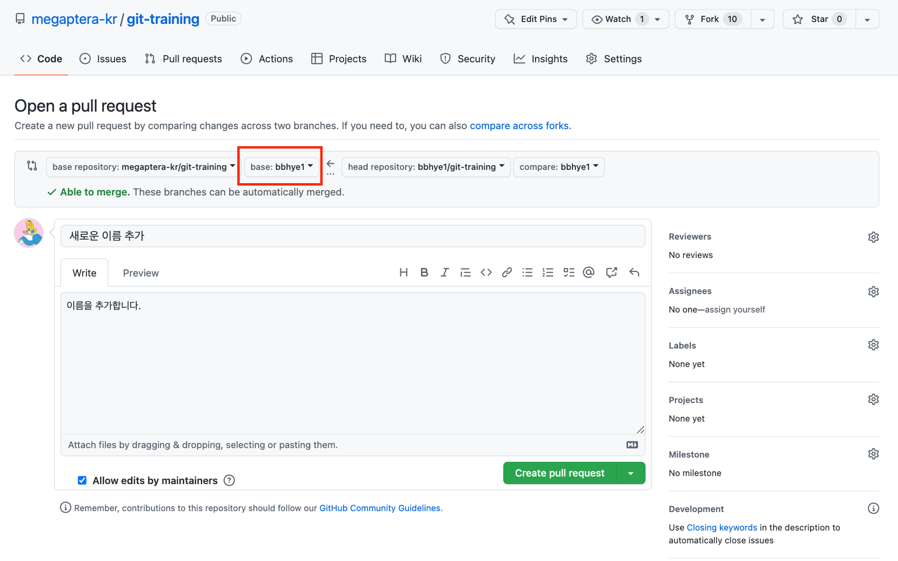

# Git Training 가이드

## :whale2: 키워드

* git
* init
* add
* commit
* log
* remote
* branch
* pull
* fetch
* rebase
* pull request

## Git이란?

버전을 편하게 관리하는 도구이다.

## Git은 왜 사용해야 할까?

1. 최종 과정까지의 히스토리를 관리할 수 있다.
2. 이전 버전으로 타임머신을 타고 돌아갈 수 있다.
3. 협업 환경을 만들 수 있다.

## GitHub란?

git으로 저장된 내역들을 원격으로 관리하고 저장하는 공간을 제공하는 서비스이다.

따라서 git이 영상이라면 github는 유튜브인 셈이다.

## Git 준비 체조

1. git 설치
2. github 가입
3. 프로젝트 폴더 생성

## 터미널 환경 설정

iterm2 설치

## GitHub 연결

GitHub을 연결해서 사용하실 때 SSH를 통한 GitHub 연결을 습관화 하자. https로 연결하시는 분들이 계신데 권장되지 않는 방식이다.

[SSH를 통한 GitHub 연결](https://docs.github.com/ko/authentication/connecting-to-github-with-ssh)

## Git 온보딩

```shell
# git을 사용하겠다.
git init

# 파일 추가 (카메라 앞으로 물건 가져가기)
git add README.md

# 변경 점 알라기 (찰칵)
git commit -m "비빔밥 레시피 1번 밥 짓기 추가"

# 커밋 로그 확인하기
git log --oneling 

# GitHub에 Repository 생성한다.

# remote = 원경 저장소, origin = 원격 저장소 이름
git remote add origin <복사한 Repository 주소>

# 메인으로 할 줄기의 이름을 main으로 한다.
git branch -M main

# 로컬 저장소에 있는 버전을 원격 저장소의 main 브랜치에 push 한다.
# -u = 로컬 저장소를 원격 저장소랑 연결하기 위한 것 (처음 한 번만 사용)
git push -u origin main

# 원격 저장소에 있는 변경 사항을 로컬 저장소화 동기화 시키기
git pull 

or

git fetch
git rebase/origin
```

## branch란?

git에서는 브랜치와 원격 저장소가 서로 독립적으로 존재한다. 각 브랜치는 서로 다른 원격 저장소에 연결될 수 있다.

## git pull란?

git pull은 git fetch와 git merge 명령의 결합이다.

git pull은 현재 브랜치와 연결된 원격 저장소의 변경 사항을 가져오면서 자동으로 로컬 브랜치와 머지한다.

이렇게 하면 로컬 브랜치에 머지 커밋이 추가되어 커밋 히스토리가 복잡해진다.

## git fetch란?

git fetch는 현재 브랜치와 연결된 원격 저장소의 변경 사항을 가져오기만 한다.

이 명령은 로컬 변경 사항과 충돌을 발생시키지 않는다.

## git rebase란?

여러 개의 커밋을 합치거나 커밋의 순서를 변경하는 작업을 수행한다.

## git rebase 예시

git merge와 달리, 현재 브랜치 A와 대상 브랜치 B를 병합하지 않고, 대상 브랜치 B에서 변경된 내용을 순차적으로 적용하여 브랜치 A에 합치는 작업을 수행한다.

따라서

1. 커밋 히스토리가 더 깔끔하게 유지되고, 머지 작업으로 인해 발생하는 불필요한 머지 커밋을 생성하지 않는다.

2. git rebase/origin 명령은 로컬 브랜치에서 원격 저장소의 변경 사항을 가져오면서도 로컬 변경 사항을 유지할 수 있다.

## git pull --rebase

git pull에 --rebase 옵션을 사용하면 git merge 대신 git rebase를 사용한다.

원격 저장소의 변경 사항을 가져와서 병합하지 않고, 명령어를 사용하여 로컬 브랜치의 변경 사항을 원격 저장소의 최신 변경 사항 위에 적용하는 것이다.

`원격 저장소의 최신 변경 사항 위에 적용하는 것`는 로컬 브랜치의 커밋을 원격 저장소의 최신 커밋 위에 적용하여 로컬 브래친의 변경 사항을 최신으로 유지한다는 의미이다.

로컬 브랜치와 원격 저장소의 커밋 기록을 일치 시킬 수 있다.

## git pull --rebase vs git fetch 후 git rebase

결과적으로는 같을 수 있지만 과정이 다르다. 'pull' 명령어는 로컬에 바로 변경사항을 적용하니 충돌이 일으키거나 할 확률이 높다. fetch 를 먼저해서 원격 저장소의 최신 변경사항을 받아와서 확인 후 rebase 하시는걸 추천드립니다.

## git rebase --continue

git rebase 명령으로 충돌이 발생할 수 있다. 충돌을 해결하고 난 뒤, 다시 git rebase를 계속하기 위해서는 git add 후에 이 명령어를 실행한다.

## GUI 도구 설치

source tree

## Pull Request 훈련하기

과제 GitHub repository 를 fork한다.

```shell
# origin 원격 저장소 추가
git clone <복사한 Repository 주소>

# 원격 저장소 추가
# PR 보낼 저장소 주소를 upstream이라는 이름으로 추가한다.
git remote add upstream <PR 보낼 원격 Repository 주소>

# 원격 저장소 확인
git remote -v

# 아래와 같은 결과가 나왔는지 확인한다.
origin      git@github.com:bbhye1/git-training.git (fetch)
origin      git@github.com:bbhye1/git-training.git (push)
upstream      git@github.com:megaptera-kr/git-training.git (fetch)
upstream      git@github.com:megaptera-kr/git-training.git (push)

# upstream 원격 저장소의 최신 상태를 반영한다.
git fetch upstream

git rebase upstream/main

# 로컬 저장소에서 새 브랜치 생성 (브랜치 이름은 자신의 깃헙 유저네임으로 설정하기)
# 해당 브랜치는 upstream 저장소의 main 브랜치를 기반으로 만든다.
# upstream/main 브랜치의 최신 커밋을 가져와서 새로운 브랜치를 만든다.
# 기존의 upstream/main 브랜치에서 작업하던 내용을 계속해서 이어받아서 새로운 브랜치에서 작업할 수 있도록 해준다.
# 이후에 upstream/main 브랜치에서 변경사항이 생길 경우 이를 병합하기 쉽다.
git switch -c <브랜치 이름> upstream/main
```

작성을 진행합니다.

작성이 완료된 후 변경된 점을 커밋합니다.

```shell
git add . 

git commit

#origin 원격 저장소에 작업 브랜치를 올립니다. 
git push origin <브랜치 이름>
```

New Pull Request를 보내 과제를 제출한다.

```plaintext
PR(Pull Request)을 요청 할 때, base repository의 main에 PR 요청을 보내는 것이 아닌 꼭 이미 생성되어 있는 본인의 GitHub Username과 동일한 브랜치에 보내야 한다는 점을 기억해주세요.
```


