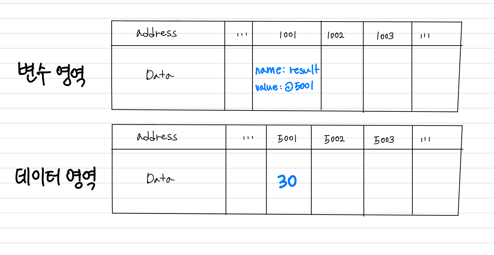

# 새로운 값을 할당하면 기존 메모리 주소를 사용하지 않는 이유

## :whale2: 키워드

* 값
* 변수
* 식별자
* 메모리

## 궁금증

```javascript
var result;
result = 30;
```

위 코드는 undefined가 들어있던 메모리 공간을 지우고 새로운 메모리 공간에 30을 넣게 됩니다. 기존 메모리 공간에 넣지 않고 새로운 메모리 공간을 만드는 이유가 뭘까요?

## 메모리에는 무엇이 저장되는가?

메모리는 데이터를 저장할 수 있는 메모리 셀의 집합체입니다. 각 셀은 고유의 메모리 주소를 갖습니다. 우리는 어떠한 값에 접근할 때 그 값의 메모리 주소에 직접 접근하지 않습니다. 안전하게 변수를 이용합니다. 변수의 이름인 식별자는 메모리 안에 있는 값의 주소를 기억하기 위해서, 메모리 안에 값 뿐만 아니라 식별자와 값의 매핑 관계도 저장되어 있습니다.

## 메모리에 어떻게 저장이 되는가?



값은 데이터 영역에 저장됩니다. 그리고 식별자와 값의 매핑 관계는 변수영역에 저장됩니다. 식별자를 이용하면 메모리 주소를 직접 접근하지 않아도 값을 저장하고 참조할 수 있습니다.

## 메모리 주소가 바뀌는 이유는?

자바스크립트에서 숫자형 데이터는 메모리에서 1byte의 공간을 확보하지만, 문자열 데이터는 정해진 규격이 없습니다. 따라서 데이터의 종류가 변환된다면 그에 맞춰서 공간의 크기를 변경해야 하는 작업이 생기게 됩니다. 자바스크립트 엔진은 이런 불필요한 작업을 피하기 위해 새로운 공간을 확보하고 그곳에 값을 할당합니다. 이전 공간은 어떤 식별자도 참조하지 않기 때문에 가비지 콜렉터에 의해서 메모리가 해제됩니다.
